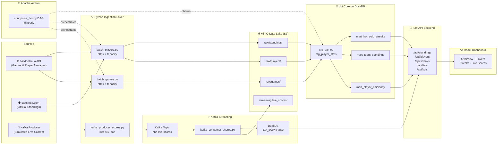

# 🏀 CourtPulse — Real-Time NBA Analytics Pipeline

> A production-grade, fully containerised end-to-end Data Engineering project that ingests NBA game data, processes it in real-time and batch, stores it in a Lakehouse architecture, and serves a premium analytics dashboard.

---

## Architecture



---

## Data Sources

| Source | Endpoint | Data | Auth |
|--------|----------|------|------|
| balldontlie.io | `/api/v1/games` | Game scores, dates, teams | None (free) |
| balldontlie.io | `/api/v1/season_averages` | Player season stats | None (free) |
| balldontlie.io | `/api/v1/stats` | Per-game player stats | None (free) |
| stats.nba.com | `leaguestandingsv3` | Official league standings | None (headers required) |
| Kafka (simulated) | `nba-live-scores` topic | Live game events every 30s | Internal |

---

## Tech Stack

| Tool | Role | Justification |
|------|------|---------------|
| **Python / httpx** | Batch ingestion | Async-capable, modern HTTP client with type hints |
| **tenacity** | Retry logic | Declarative retry policy with exponential back-off |
| **Apache Kafka** | Streaming backbone | Industry-standard durable message queue |
| **MinIO** | S3-compatible data lake | Self-hosted, free, S3 API compatible |
| **DuckDB** | Analytical warehouse | In-process OLAP DB, reads Parquet natively |
| **dbt Core** | SQL transformations | Version-controlled, testable SQL models |
| **Apache Airflow** | Orchestration | DAG-based scheduling with retries and monitoring |
| **FastAPI** | REST API backend | Modern async Python API framework with auto-docs |
| **React 18 + Vite** | Frontend SPA | Fast builds, HMR, modern ecosystem |
| **TailwindCSS** | Styling | Utility-first CSS with custom design tokens |
| **Recharts** | Data visualisation | Composable chart library for React |
| **React Query** | Data fetching | Caching, background refetch, stale-while-revalidate |
| **Docker Compose** | Deployment | Single-command local orchestration of all services |
| **pytest** | Testing | Standard Python testing framework |

---

## Quick Start

```bash
# 1. Clone the repository
git clone <your-repo-url>
cd courtpulse

# 2. Copy environment config
cp .env.example .env

# 3. Launch all services
docker-compose up -d

# 4. Open the dashboard
open http://localhost:3000
```

> **First-run note:** Airflow takes ~60 seconds to initialise. The backend will return empty arrays until the first pipeline run completes. Trigger a manual DAG run at http://localhost:8080 to populate data immediately.

---

## Services

| Service | URL | Description |
|---------|-----|-------------|
| 🎨 Frontend Dashboard | http://localhost:3000 | React SPA — Overview, Players, Streaks, Live |
| 🚀 FastAPI Backend | http://localhost:8000 | REST API |
| 📖 API Documentation | http://localhost:8000/docs | Swagger / OpenAPI auto-docs |
| 🎼 Airflow UI | http://localhost:8080 | DAG monitoring and manual triggers |
| 🗄️ MinIO Console | http://localhost:9001 | S3 data lake browser |

---

## Default Credentials

| Service | Username | Password |
|---------|----------|----------|
| Airflow | `admin` | `admin` |
| MinIO | `minioadmin` | `minioadmin` |

---

## Project Structure

```
courtpulse/
├── docker-compose.yml          # All services
├── .env.example                # Environment template
├── README.md
│
├── ingestion/
│   ├── batch_games.py          # Fetches game data from balldontlie API
│   ├── batch_players.py        # Fetches player averages + NBA standings
│   └── kafka_producer_scores.py # Simulates 3 live games → Kafka
│
├── kafka/
│   └── kafka_consumer_scores.py # Consumes → MinIO JSONL + DuckDB upsert
│
├── storage/
│   └── minio_client.py         # MinIO S3 utilities
│
├── dbt_courtpulse/
│   ├── dbt_project.yml
│   ├── profiles.yml            # DuckDB connection
│   └── models/
│       ├── staging/
│       │   ├── stg_games.sql
│       │   └── stg_player_stats.sql
│       └── marts/
│           ├── mart_player_efficiency.sql  # Transform 1: PER + tiers
│           ├── mart_team_standings.sql     # Transform 2: W/L/records/streaks
│           └── mart_hot_cold_streaks.sql   # Transform 3: 5-game rolling win%
│
├── airflow/
│   └── dags/
│       └── courtpulse_pipeline.py  # @hourly DAG: ingest → dbt → validate
│
├── backend/
│   ├── Dockerfile
│   ├── requirements.txt
│   └── main.py                 # FastAPI: /api/standings /players /streaks /live /kpis
│
├── frontend/
│   ├── Dockerfile              # node:20 build → nginx:alpine serve
│   ├── nginx.conf              # SPA routing + /api proxy
│   ├── package.json
│   ├── vite.config.js
│   ├── tailwind.config.js
│   ├── index.html
│   └── src/
│       ├── App.jsx             # Router + layout
│       ├── main.jsx
│       ├── index.css           # Global styles + glass-card + animations
│       ├── components/
│       │   ├── Navbar.jsx
│       │   ├── KpiCard.jsx     # Animated count-up metric card
│       │   ├── StandingsTable.jsx
│       │   ├── PlayerTable.jsx
│       │   ├── StreakCard.jsx  # SVG ring progress
│       │   └── LiveScoreCard.jsx
│       └── pages/
│           ├── Overview.jsx    # KPIs + standings + bar chart
│           ├── Players.jsx     # Table + scatter + fantasy bar
│           ├── Streaks.jsx     # Hot/cold cards + line chart
│           └── LiveScores.jsx  # 30s auto-refresh grid
│
└── tests/
    ├── test_transformations.py  # 5 pure-Python unit tests
    └── test_data_quality.py     # 3 in-memory DuckDB tests
```

---

## Running Tests

```bash
# Install test dependencies
pip install pytest duckdb

# Run all tests
pytest tests/ -v

# Run only transformation tests
pytest tests/test_transformations.py -v

# Run only data quality tests
pytest tests/test_data_quality.py -v
```

---

## dbt Models

| Model | Type | Description |
|-------|------|-------------|
| `stg_games` | View | Cleaned game records from Parquet; adds `winner`, `point_diff` |
| `stg_player_stats` | View | Season averages with `fantasy_score`; filtered to ≥10 games |
| `mart_player_efficiency` | Table | Simplified PER, team rank, tier classification |
| `mart_team_standings` | Table | Wins/losses/records/streaks derived from game results |
| `mart_hot_cold_streaks` | Table | 5-game rolling win rate with streak labels |

---

## API Endpoints

| Method | Endpoint | Description | Query Params |
|--------|----------|-------------|--------------|
| GET | `/health` | Liveness probe | — |
| GET | `/api/standings` | Team standings | `?conference=East\|West` |
| GET | `/api/players` | Player efficiency | `?team=LAL&tier=Star&limit=50` |
| GET | `/api/streaks` | Hot/cold streak per team | — |
| GET | `/api/live` | Live game scores | — |
| GET | `/api/kpis` | Aggregated KPI summary | — |

Interactive docs: **http://localhost:8000/docs**

---

## Pipeline Flow

```
@hourly trigger (Airflow)
    │
    ├── ingest_games      → MinIO raw/games/YYYY-MM-DD/games.parquet
    ├── ingest_players    → MinIO raw/players/ + raw/standings/
    ├── dbt_run_staging   → DuckDB views: stg_games, stg_player_stats
    ├── dbt_run_marts     → DuckDB tables: mart_player_efficiency, mart_team_standings, mart_hot_cold_streaks
    ├── validate_quality  → Checks mart tables are non-empty
    └── done

Kafka (continuous, independent of Airflow):
    kafka_producer_scores  →  [nba-live-scores topic]  →  kafka_consumer_scores
                                                            ├── MinIO streaming/live_scores/YYYY-MM-DD/HH/events.jsonl
                                                            └── DuckDB live_scores table (upsert)
```

---

## Environment Variables

| Variable | Default | Description |
|----------|---------|-------------|
| `MINIO_ENDPOINT` | `minio:9000` | MinIO S3 host:port |
| `MINIO_ACCESS_KEY` | `minioadmin` | MinIO access key |
| `MINIO_SECRET_KEY` | `minioadmin` | MinIO secret key |
| `KAFKA_BOOTSTRAP_SERVERS` | `kafka:9092` | Kafka broker address |
| `DUCKDB_PATH` | `/data/courtpulse.duckdb` | Path to DuckDB database file |
| `AIRFLOW_UID` | `50000` | Airflow user ID for volume permissions |
| `NBA_SEASON` | `2024` | NBA season year to ingest |

---

## License

MIT — free for educational and personal use.
